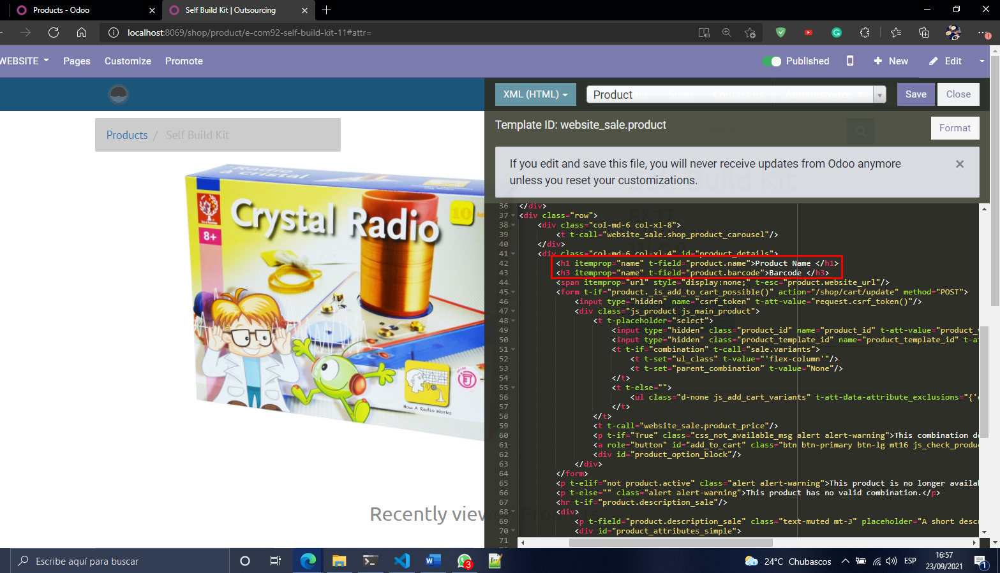
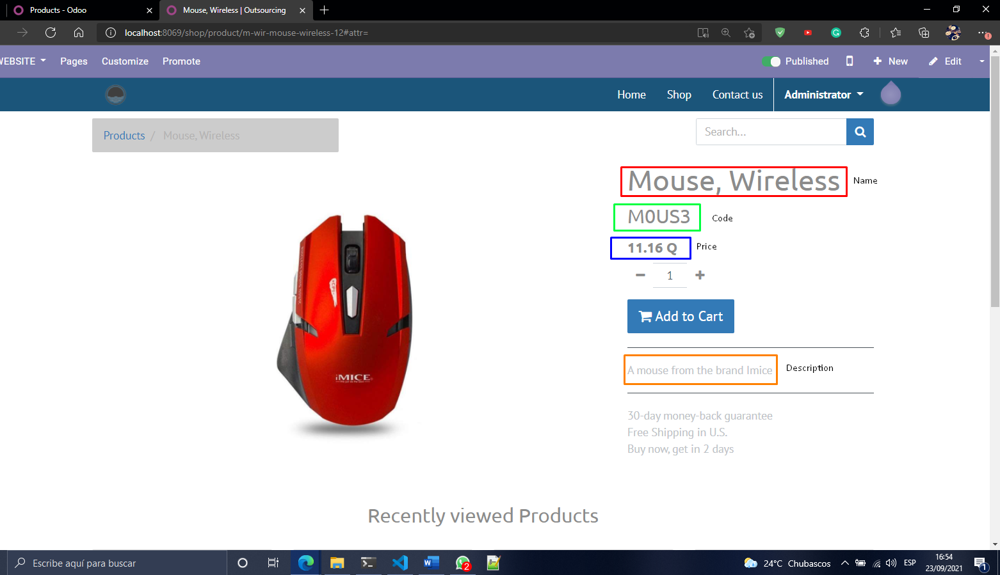
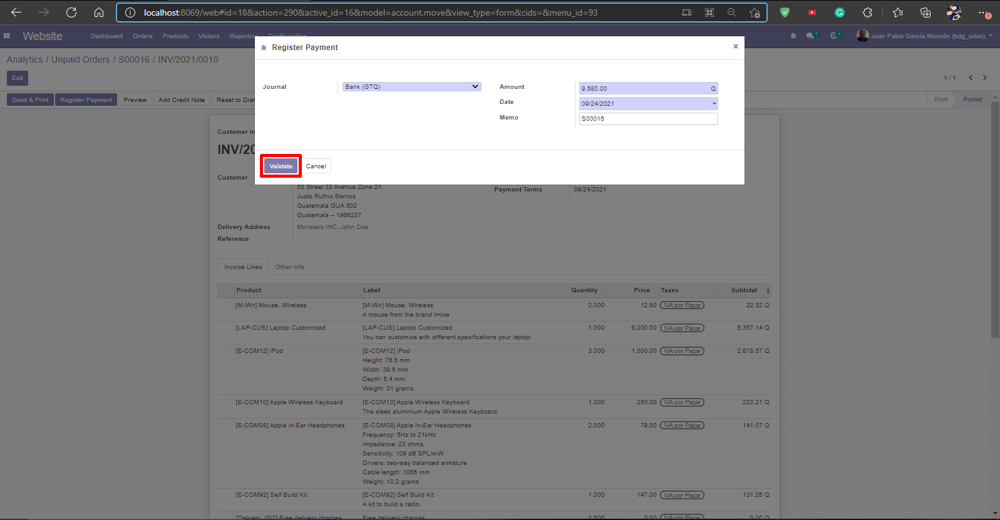
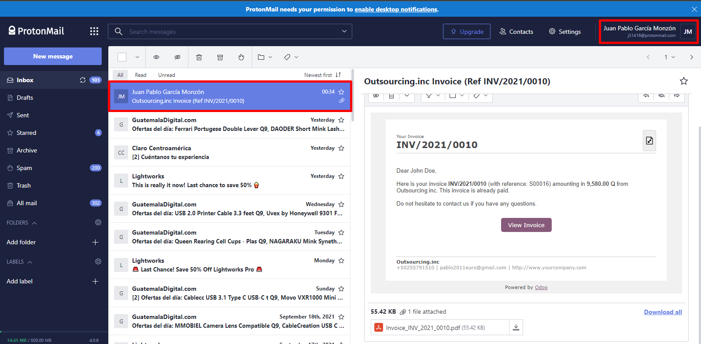

# Python/Odoo Programmer Test
## Odoo Implementation
I used a Docker Hub image using WSL2 with an Ubuntu 20.04 LTS virtual machine to run Odoo, using the 13th version. Docker-compose was the tool of preference to deploy the containers needed in order for Odoo to be displayed and customized.

The containers are:

* PostgreSQL:13
* Odoo:13

It's a requirement to create a file called "odoo_pg_pass" for managing the keys that PostgreSQL and Odoo ask.

The yaml file used:
```dockerfile
version: '3.1'
services:
  web:
    image: odoo:13.0 "13th version"
    depends_on:
      - db
    ports:
      - "8069:8069" "the port where it's going to be listening"
    volumes:
      - odoo-web-data:/var/lib/odoo
      - ./config:/etc/odoo
      - ./addons:/mnt/extra-addons
    environment:
      - PASSWORD_FILE=/run/secrets/postgresql_password
    secrets:
      - postgresql_password
  db:
    image: postgres:13
    environment:
      - POSTGRES_DB=postgres
      - POSTGRES_PASSWORD_FILE=/run/secrets/postgresql_password
      - POSTGRES_USER=odoo
      - PGDATA=/var/lib/postgresql/data/pgdata
    volumes:
      - odoo-db-data:/var/lib/postgresql/data/pgdata
    secrets:
      - postgresql_password
volumes:
  odoo-web-data:
  odoo-db-data:

secrets:
  postgresql_password:
    file: odoo_pg_pass "local file"
```
After Odoo is deployed


## Part 1
We can begin to add the applications needed for the requirements needed from the test, these are:

* Website
* Sales
* E-commerce
* Invoicing
* Inventory


After all the applications are installed we edit our Home Page with the aid of the Website module.


Now to the main reason of having an E-commerce module, adding the products. I'll use the template that Odoo give to the user to add in a batch, but it can be created one by one also.


With products, now our Shop has something to sell, but we have to tidy some details in order to comply with the requirements of the test. These are that some information of the product needs to be displayed when the user will buy something. The data is:
* Name
* Code
* Price
* Description

By default Odoo is going to give us the name, price and description of the product. We only have to add the code, and the photo.


With the resource that Odoo has to edit the HTML/JavaScript/CSS of the product, we add this little line of HTML that will display the Code in a "h3" title. This will not only edit the current product but all that are published in the Shop





This completes the part 1 of the test. The part 2 is to buy one product, add information like address and email to create an invoice for the user.

## Part 2
In order to send an email we have to twick a little some of the settings. First we need an email server, in my case I'll use gmail.

So first we need to have a gmail account, and enable the option to manage third party emails.


In Odoo we have to follow these steps:


* Enable the Developer mode in Odoo "General Settings". In my case it's already enable.

* Goto Settings ‣ Technical ‣ Email ‣ Templates

* Open the first template, in my case "Partner Mass Mail"

* Click "Edit" and choose "Advanced Settings"

* Select "Outgoing Mail Server"  ‣ "Create and Edit"

* Set the SMTP information

* Test the connection

* Save the template


Now we can buy some products from our "Shop". And we'll use the page as a visitor, not as the administrator.


The products that will be bought are:

* 2 "Mouse, Wireless"
* 1 "Laptop Customized"
* 3 "iPod"
* 1 "Apple Wireless Keyboard"
* 2 "Apple In-Ear Headphones"
* 1 "Self Build Kit"


Now I'll confirm the Sale in the "Unpaid Orders" and the Invoice will be send.








The Invoice has been send, thanks for the chance to do this test. 